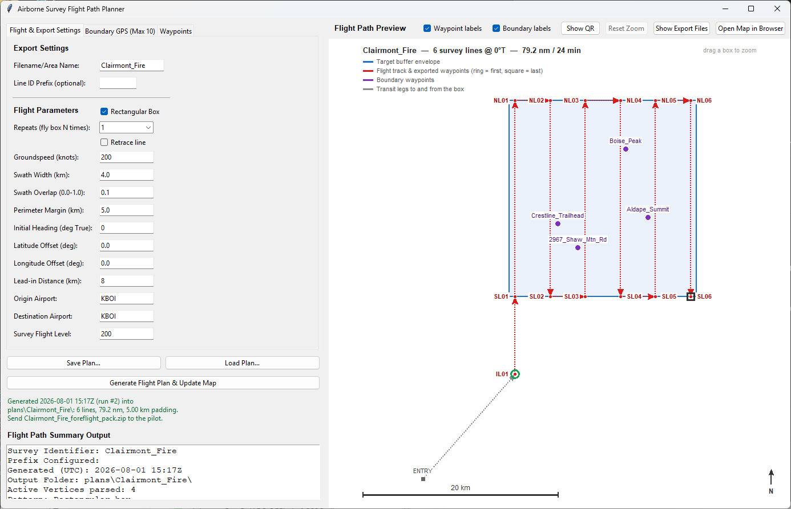

# Airborne Survey Flight Planner

A Tkinter GUI that generates airborne survey flight patterns over a fire or target area and
exports waypoints for ForeFlight and a Honeywell FMS.



Above: a 4 km swath at heading 000 — six equal-length north-south lines, each end named for
the compass end it sits at, so `SL03` is the south end of line 3. The grey dashed leg runs in
from a transit waypoint to `IL01`, an 8 km lead-in on the line's own bearing, so the aircraft
is established on track before the first line begins.

## Features
- Interactive Tkinter GUI to define survey boundary points and flight parameters
- Generates an optimized rectangular survey pattern based on swath width, overlap, heading, and margins
- Exports two CSV formats: ForeFlight-friendly and Honeywell-friendly
- Draws a scaled flight-path preview directly in the window (native Tk canvas — no browser engine needed)
- Saves an interactive Folium HTML map, opened on demand via **Open Map in Browser**
- Exports a KML/KMZ map layer and a ForeFlight content pack for getting the pattern onto an iPad
- Saves and reloads a whole plan — boundary points and every parameter — as JSON
- Renders a scannable QR of the ForeFlight route link right in the window (no Pillow needed)

## Layout
- `airborne_survey_gui.py` — main GUI (scaled path preview drawn in-window; Folium map opens in a browser)
- `notebooks/` — the original exploratory notebooks. Self-contained: they carry their own
  copy of the geometry code and import nothing from the GUI, so fixes to the app do **not**
  reach them. They write into `plans/<AREA>/` like the GUI does.
- `golden_csv/` — the pilot's reference flight plans, the format specification both CSV
  exporters are built against. Tracked deliberately, exempt from the `*.csv` ignore rule.
- `plans/` — generated output, one directory per plan. Entirely git-ignored and regenerable.
- `foreflight.md` — how ForeFlight ingests waypoints and overlays, with confidence markers
- `requirements.txt` — pinned dependencies used by notebooks and scripts

## Dependencies
The primary Python dependencies (also listed in `requirements.txt`) include:

- numpy
- shapely
- folium
- pandas
- qrcode

Additional packages required by the GUIs but not always present in `requirements.txt`:

- pyproj
- Pillow (PIL) — **only** for the QR image in `notebooks/SendToForeFlight.ipynb`.
  The GUI's own QR view draws on the canvas and does not need it.

On macOS, `tkinter` is usually provided by the system Python. If using Conda, install `tk` via Conda or ensure the selected Python includes Tk support.

## Quick install
1. (Recommended) Create and activate a Python environment:

```bash
conda create -n flightplan python=3.11 -y
conda activate flightplan
```

2. Install pinned deps:

```bash
pip install -r requirements.txt
# pyproj is required; Pillow only if you want the notebook's QR image
pip install pyproj
```

If you prefer `pipenv` or `venv`, create an environment and use the same `pip install` commands.

## Usage

Enter boundary waypoints (minimum 3), set parameters, then click the generate button.

```bash
python airborne_survey_gui.py
```

Boundary points and flight parameters can be saved and reloaded with **Save Plan…** /
**Load Plan…**, above the generate button, so a set of points never has to be retyped. Every
run also drops a `<AREA>_plan.json` next to its outputs, so any past plan folder can be
reloaded as-is. The dialogs open on `plans/` by default.

**Rectangular Box** (on by default) flies the smallest rectangle enclosing the target plus
its perimeter margin, at the chosen heading — equal-length parallel lines, "mow the lawn".
Unchecked, the passes are clipped to the padded target outline instead: less ground covered,
but lines of very uneven length.

**Repeats** (1–4) flies the whole box that many times, with identical line directions each
cycle. The names repeat each cycle, because a name is a place rather than a step in the
sequence.

**Lead-in Distance** puts a waypoint that far back from the first line's start, along that
line's own bearing, so the aircraft rolls out wings-level and is established on track before
the line — and the sensor run — begins. It is named `IL01` (intercept, line 1), so the
sequence reads `IL01`, `SL01`, `NL01`. Set 0 to disable.

**Retrace line** flies each row out and back before moving to the next, rather than once
through. The return keeps its line's number and revisits its names, so three rows read
`SL01, NL01, SL01, SL02, NL02, SL02, SL03, NL03, SL03`. Distance on the lines doubles; the
turns between rows do not, so the total grows by less than 2x.

The **Waypoints** tab adds transit legs flown before reaching the box and after leaving it,
on top of the origin and destination airports. Each row takes **either** an identifier
(`BOI`, `DANDD`) **or** a lat/lon pair:

- An **identifier** goes into the route link as-is for ForeFlight to resolve. It costs about
  6 characters against 25 for a coordinate pair, which keeps the QR sparser — but its
  position is unknown here, so it cannot be drawn, written to the CSVs, or counted in the
  transit distance.
- A **lat/lon** row is written to both CSVs bracketing the survey waypoints, drawn on the
  preview as a grey dashed leg, and included in the transit distance.

The survey box is entered at whichever corner is nearest the last transit waypoint, rather
than always at line 1's start — approaching the default area from the north, that is a
23.98 km run in instead of 43.55 km across the box and back. The ground covered is
identical either way.

Both coordinate grids have **Move** buttons on each row, so a new point can be slotted
between two filled rows rather than only appended. Rows are read top to bottom. On the
Waypoints tab that sets the order the legs are flown; on the Boundary GPS tab it reorders
the polygon's vertices, which changes the shape of the survey area.

Typed labels are coerced to what ForeFlight accepts — all capitals, at least 3 characters,
at least one letter, no spaces — so `entry gate` becomes `ENTRY_GATE`. Anything that cannot
be salvaged falls back to a generated name like `B02`. The summary reports survey and
transit distance separately.

**Waypoints in CSV** on the summary panel, and the status line under the button, give the
total number of points written — the row count of both CSVs, split into survey and transit
when transit rows are filled. It counts what the pilot actually loads, so consecutive
duplicate names are already collapsed and identifier-only transit rows are excluded, since
those carry no position and are never written.

The perimeter margin is applied to the target before the box is taken, so the requested
padding clears the boundary on all sides at any heading. The summary panel reports the
padding actually achieved — trust that figure over the requested one, since a non-zero
lat/lon offset shifts coverage and eats into it.

Outputs are created in one directory per plan, `./plans/<AREA>/`. The whole `plans/` tree is
git-ignored — it is all regenerable, so nothing there is precious:

- `<AREA>_waypoints_foreflight.csv` — waypoint list in ForeFlight's column order
- `<AREA>_waypoints_honeywell.csv` — Honeywell FMS formatted CSV
- `<AREA>_flight_path.html` — Folium map over real terrain, with the survey waypoints,
  transit legs and boundary points on separate toggleable layers (open with the
  button, or double-click the file)
- `<AREA>_survey.kml` / `.kmz` — survey pattern as a ForeFlight **map layer**: AirDrop or
  email it and the lines, buffer and named points display as a toggleable overlay without
  entering the waypoint database
- `<AREA>_foreflight_pack.zip` — ForeFlight **content pack** bundling the overlay *and* a
  correctly-named `user_waypoints.csv`. This is the one to send the pilot: he gets the same
  overlay plus real waypoints he can build a route from and override.
- `<AREA>_plan.json` — the saved plan (boundary points and parameters) that produced all of the above
- `<AREA>_foreflight_route.txt` — the ForeFlight route string and its `foreflightmobile://`
  link, for pasting into an email

**Drag a box on the preview** to zoom into it; **right-click** the preview, or press
**Reset Zoom**, to go back to the full extent. The dragged selection is grown to the pane's
shape first, so a metre across always reads the same as a metre up and the pattern is never
stretched. Useful once transit legs stretch the view — they can push the survey box down to
a corner.

Use **Show Export Files** in the app to open the folder for AirDropping.

**Show QR** swaps the right pane for a QR code of that route link. Scanning it with the iPad
camera opens the whole survey in ForeFlight as a route, origin and destination included, with
no file transfer at all. The endpoints and cruise level come from the **Origin Airport**,
**Destination Airport** and **Survey Flight Level** fields (200 means FL200, 20,000 ft).
Drawn directly on the canvas, so Pillow is not required.

See [foreflight.md](foreflight.md) for the import rules these files are built against,
including which claims are verified against ForeFlight's docs and which are not.

## Notes & Tips
- Waypoints are named `SL01` / `NL01` — the **south and north ends of line 1**. The letters
  are N/S for lines running predominantly north-south and E/W for east-west, following the
  line's own bearing. The lead-in is `IL01`.
- A name is a *place*, not a step in the sequence, so a retrace revisits the same names and
  the list reads in flight order: `SL01, NL01, SL01, SL02, NL02, SL02`. The turnaround is
  listed once. Names are therefore not unique across a plan with repeats or retrace.
- **Five characters is the ceiling** a navigation database allows (Jeppesen NavData,
  following ARINC 424), so line numbers pad to two digits and widen only when needed.
- **Line ID Prefix** is optional and empty by default. One or two letters or digits go in
  front of every name, for telling two areas apart in the same database — but they spend
  characters from that same budget, so a prefix only fits while the line count is under 100.
  The exporter refuses rather than truncating if a name would overflow.
- Provide at least 3 boundary points to define the survey polygon.
- The GUI runs one calculation at startup, so the preview and CSVs already exist before you
  click anything. The status line under the button stamps each run so repeat clicks are visible.
- Tile-backed maps need real JavaScript; use **Open Map in Browser** for that view.
- `notebooks/SendToForeFlight.ipynb` does the same route link and QR as the **Show QR**
  button, but standalone against an exported CSV. It calls `make_image()`, so unlike the
  GUI it does need Pillow.

## Getting a plan onto the iPad from Windows
AirDrop does not exist on Windows, so email the content pack to yourself or put it in cloud
storage, then **save it into the Files app** — sharing a zip straight out of the Google Drive
app does not offer ForeFlight. In Files, **touch and hold** the zip (a single tap extracts
it, which is not what you want), then **Share** → scroll the app row right → **Copy to
ForeFlight**. It lands under **More > Custom Content**.

Full detail, including what is verified against ForeFlight's docs and what is not, is in
[foreflight.md](foreflight.md).

## License
Add your preferred license here.

---
Generated from analysis of the repository Python scripts.
